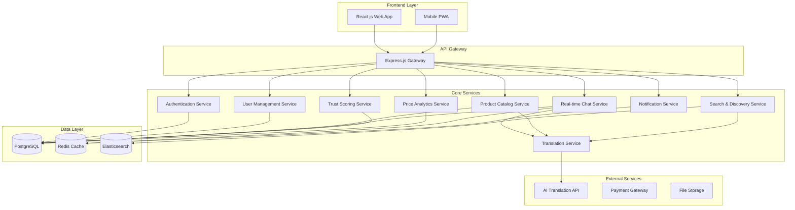

# Design Document: The Multilingual Mandi

## Overview

The Multilingual Mandi is a comprehensive marketplace platform that eliminates language barriers in Indian commerce through AI-powered real-time translation. The system employs a modern microservices architecture built on React.js/TypeScript frontend, Node.js/Express backend, and PostgreSQL database, designed to handle high-volume multilingual transactions with cultural sensitivity.

The platform serves two primary user types: vendors who list products and buyers who discover and purchase items. The core innovation lies in seamless real-time translation that preserves context and cultural nuances while maintaining transaction security and trust through sophisticated reputation scoring.

## Architecture

### High-Level Architecture

The system follows a microservices architecture pattern with clear separation of concerns:



### Technology Stack

**Frontend:**
- React.js 18+ with TypeScript for type safety
- TailwindCSS for responsive design system
- Socket.io-client for real-time communication
- React Query for state management and caching
- React Router for navigation
- PWA capabilities for mobile experience

**Backend:**
- Node.js with Express.js framework
- TypeScript for type safety across the stack
- Socket.io for real-time WebSocket connections
- JWT for authentication and authorization
- Prisma ORM for database operations
- Bull Queue for background job processing

**Database & Storage:**
- PostgreSQL as primary database
- Redis for caching and session storage
- Elasticsearch for advanced search capabilities
- AWS S3 or similar for file storage

**External Integrations:**
- Google Translate API or Azure Translator for AI translation
- Stripe or Razorpay for payment processing
- AWS SES for email notifications
- CloudFront for CDN and static asset delivery

## Components and Interfaces

### Authentication Service

**Purpose:** Manages user registration, login, and session management with multilingual support.

**Key Components:**
- `AuthController`: Handles authentication endpoints
- `JWTService`: Manages token generation and validation
- `PasswordService`: Handles password hashing and validation
- `LanguagePreferenceService`: Manages user language settings

**Interfaces:**
```typescript
interface AuthService {
  register(userData: UserRegistrationData): Promise<AuthResult>
  login(credentials: LoginCredentials): Promise<AuthResult>
  refreshToken(token: string): Promise<AuthResult>
  logout(userId: string): Promise<void>
  setLanguagePreference(userId: string, language: string): Promise<void>
}

interface UserRegistrationData {
  email: string
  password: string
  name: string
  preferredLanguage: string
  userType: 'vendor' | 'buyer'
  phoneNumber?: string
}
```

### Translation Service

**Purpose:** Provides real-time AI-powered translation with context preservation and cultural adaptation.

**Key Components:**
- `TranslationEngine`: Core translation logic with caching
- `ContextPreserver`: Maintains business context in translations
- `CulturalAdapter`: Adapts content for regional preferences
- `TranslationCache`: Redis-based caching for performance

**Interfaces:**
```typescript
interface TranslationService {
  translateText(text: string, fromLang: string, toLang: string, context?: TranslationContext): Promise<TranslationResult>
  translateBatch(texts: string[], fromLang: string, toLang: string): Promise<TranslationResult[]>
  detectLanguage(text: string): Promise<string>
  getCachedTranslation(key: string): Promise<TranslationResult | null>
}

interface TranslationResult {
  translatedText: string
  originalText: string
  confidence: number
  detectedLanguage?: string
  culturalAdaptations?: string[]
}
```

### Product Catalog Service

**Purpose:** Manages product listings with multilingual metadata and search optimization.

**Key Components:**
- `ProductManager`: CRUD operations for products
- `CategoryService`: Manages product categorization
- `ImageProcessor`: Handles product image upload and processing
- `MultilingualIndexer`: Creates searchable multilingual content

**Interfaces:**
```typescript
interface ProductService {
  createProduct(productData: ProductCreationData): Promise<Product>
  updateProduct(productId: string, updates: ProductUpdateData): Promise<Product>
  getProduct(productId: string, language?: string): Promise<Product>
  getProductsByVendor(vendorId: string, language?: string): Promise<Product[]>
  deleteProduct(productId: string): Promise<void>
}

interface Product {
  id: string
  vendorId: string
  title: MultilingualText
  description: MultilingualText
  price: number
  currency: string
  category: string
  images: string[]
  specifications: Record<string, any>
  availability: boolean
  createdAt: Date
  updatedAt: Date
}
```

### Real-time Chat Service

**Purpose:** Enables multilingual negotiations with instant translation and message history.

**Key Components:**
- `ChatManager`: Manages chat sessions and participants
- `MessageProcessor`: Handles message translation and storage
- `TypingIndicator`: Manages typing status across languages
- `MessageHistory`: Stores and retrieves conversation history

**Interfaces:**
```typescript
interface ChatService {
  createNegotiationSession(vendorId: string, buyerId: string, productId: string): Promise<ChatSession>
  sendMessage(sessionId: string, senderId: string, message: string): Promise<void>
  getMessageHistory(sessionId: string, userId: string): Promise<Message[]>
  updateTypingStatus(sessionId: string, userId: string, isTyping: boolean): Promise<void>
}

interface Message {
  id: string
  sessionId: string
  senderId: string
  originalText: string
  translatedText: Record<string, string>
  timestamp: Date
  messageType: 'text' | 'image' | 'offer'
}
```

### Trust Scoring Service

**Purpose:** Calculates and maintains reputation scores based on transaction history and user behavior.

**Key Components:**
- `TrustCalculator`: Core algorithm for trust score computation
- `TransactionAnalyzer`: Analyzes completed transactions
- `BehaviorTracker`: Monitors user interaction patterns
- `FraudDetector`: Identifies suspicious activities

**Interfaces:**
```typescript
interface TrustService {
  calculateTrustScore(userId: string): Promise<TrustScore>
  updateTrustScore(userId: string, transactionData: TransactionData): Promise<TrustScore>
  getTrustHistory(userId: string): Promise<TrustHistoryEntry[]>
  reportSuspiciousActivity(reporterId: string, suspectId: string, reason: string): Promise<void>
}

interface TrustScore {
  userId: string
  currentScore: number
  scoreHistory: TrustHistoryEntry[]
  factors: TrustFactors
  lastUpdated: Date
}

interface TrustFactors {
  transactionSuccess: number
  responseTime: number
  userFeedback: number
  accountAge: number
  verificationLevel: number
}
```

### Search and Discovery Service

**Purpose:** Provides multilingual search with intelligent ranking and personalized recommendations.

**Key Components:**
- `SearchEngine`: Elasticsearch-based multilingual search
- `RecommendationEngine`: Personalized product recommendations
- `FilterProcessor`: Handles complex search filters
- `RankingAlgorithm`: Scores search results based on relevance and trust

**Interfaces:**
```typescript
interface SearchService {
  searchProducts(query: string, filters: SearchFilters, userLanguage: string): Promise<SearchResults>
  getRecommendations(userId: string, limit: number): Promise<Product[]>
  getSimilarProducts(productId: string, limit: number): Promise<Product[]>
  indexProduct(product: Product): Promise<void>
}

interface SearchFilters {
  category?: string
  priceRange?: { min: number; max: number }
  location?: string
  trustScoreMin?: number
  availability?: boolean
}
```

## Data Models

### Core Database Schema

**Users Table:**
```sql
CREATE TABLE users (
  id UUID PRIMARY KEY DEFAULT gen_random_uuid(),
  email VARCHAR(255) UNIQUE NOT NULL,
  password_hash VARCHAR(255) NOT NULL,
  name VARCHAR(255) NOT NULL,
  user_type user_type_enum NOT NULL,
  preferred_language VARCHAR(10) NOT NULL DEFAULT 'en',
  phone_number VARCHAR(20),
  profile_image_url TEXT,
  is_verified BOOLEAN DEFAULT FALSE,
  trust_score DECIMAL(3,2) DEFAULT 0.00,
  created_at TIMESTAMP DEFAULT CURRENT_TIMESTAMP,
  updated_at TIMESTAMP DEFAULT CURRENT_TIMESTAMP
);
```

**Products Table:**
```sql
CREATE TABLE products (
  id UUID PRIMARY KEY DEFAULT gen_random_uuid(),
  vendor_id UUID REFERENCES users(id) ON DELETE CASCADE,
  title JSONB NOT NULL, -- Multilingual titles
  description JSONB NOT NULL, -- Multilingual descriptions
  price DECIMAL(10,2) NOT NULL,
  currency VARCHAR(3) NOT NULL DEFAULT 'INR',
  category VARCHAR(100) NOT NULL,
  subcategory VARCHAR(100),
  images TEXT[] DEFAULT '{}',
  specifications JSONB DEFAULT '{}',
  is_available BOOLEAN DEFAULT TRUE,
  stock_quantity INTEGER DEFAULT 0,
  created_at TIMESTAMP DEFAULT CURRENT_TIMESTAMP,
  updated_at TIMESTAMP DEFAULT CURRENT_TIMESTAMP
);
```

**Chat Sessions Table:**
```sql
CREATE TABLE chat_sessions (
  id UUID PRIMARY KEY DEFAULT gen_random_uuid(),
  vendor_id UUID REFERENCES users(id) ON DELETE CASCADE,
  buyer_id UUID REFERENCES users(id) ON DELETE CASCADE,
  product_id UUID REFERENCES products(id) ON DELETE CASCADE,
  status session_status_enum DEFAULT 'active',
  created_at TIMESTAMP DEFAULT CURRENT_TIMESTAMP,
  updated_at TIMESTAMP DEFAULT CURRENT_TIMESTAMP
);
```

**Messages Table:**
```sql
CREATE TABLE messages (
  id UUID PRIMARY KEY DEFAULT gen_random_uuid(),
  session_id UUID REFERENCES chat_sessions(id) ON DELETE CASCADE,
  sender_id UUID REFERENCES users(id) ON DELETE CASCADE,
  original_text TEXT NOT NULL,
  translated_texts JSONB DEFAULT '{}', -- Translations by language
  message_type message_type_enum DEFAULT 'text',
  created_at TIMESTAMP DEFAULT CURRENT_TIMESTAMP
);
```

**Trust Scores Table:**
```sql
CREATE TABLE trust_scores (
  id UUID PRIMARY KEY DEFAULT gen_random_uuid(),
  user_id UUID REFERENCES users(id) ON DELETE CASCADE,
  score DECIMAL(3,2) NOT NULL,
  transaction_success_rate DECIMAL(3,2) DEFAULT 0.00,
  avg_response_time_hours DECIMAL(5,2) DEFAULT 0.00,
  positive_feedback_ratio DECIMAL(3,2) DEFAULT 0.00,
  account_age_days INTEGER DEFAULT 0,
  verification_level INTEGER DEFAULT 0,
  calculated_at TIMESTAMP DEFAULT CURRENT_TIMESTAMP
);
```

### Multilingual Data Structure

Products and other user-generated content use JSONB fields for multilingual support:

```typescript
interface MultilingualText {
  en: string      // English (default)
  hi: string      // Hindi
  bn: string      // Bengali
  te: string      // Telugu
  mr: string      // Marathi
  ta: string      // Tamil
  gu: string      // Gujarati
  kn: string      // Kannada
  ml: string      // Malayalam
  pa: string      // Punjabi
  [key: string]: string  // Additional languages
}
```

## Correctness Properties

*A property is a characteristic or behavior that should hold true across all valid executions of a system—essentially, a formal statement about what the system should do. Properties serve as the bridge between human-readable specifications and machine-verifiable correctness guarantees.*

Based on the prework analysis of acceptance criteria, the following properties capture the essential correctness guarantees for the Multilingual Mandi system:

### Authentication and User Management Properties

**Property 1: Valid registration creates accounts with language preferences**
*For any* valid user registration data, the system should successfully create an account with the specified language preference settings and return appropriate confirmation.
**Validates: Requirements 1.1**

**Property 2: Invalid registration data is properly rejected**
*For any* invalid or duplicate registration information, the system should prevent account creation and return descriptive error messages without compromising security.
**Validates: Requirements 1.2**

**Property 3: Authentication round-trip consistency**
*For any* valid user account, successful authentication should grant access to the appropriate dashboard and maintain session state consistently.
**Validates: Requirements 1.3**

### Translation and Multilingual Properties

**Property 4: Translation preserves meaning across languages**
*For any* product content, translating to a target language and back to the original language should preserve the core meaning and business context.
**Validates: Requirements 2.5**

**Property 5: Real-time translation performance**
*For any* message under 500 characters in a negotiation session, translation should complete within 2 seconds while preserving the original message for context.
**Validates: Requirements 4.1, 4.2**

**Property 6: Message history maintains translation metadata**
*For any* chat session, all messages should be stored with both original text and translation metadata, maintaining complete conversation history for both parties.
**Validates: Requirements 4.5**

### Search and Discovery Properties

**Property 7: Cross-language search returns relevant results**
*For any* search query in any supported language, the system should return relevant products from all vendors regardless of the original listing language.
**Validates: Requirements 3.1**

**Property 8: Search results maintain ranking consistency**
*For any* search query, results should be ranked consistently based on relevance, trust scores, and user preferences, with higher-scoring items appearing first.
**Validates: Requirements 3.5**

**Property 9: Filter application preserves search context**
*For any* combination of search filters, applying them should maintain the original search context while dynamically updating results to match all criteria.
**Validates: Requirements 3.4**

### Product Management Properties

**Property 10: Product updates propagate across all languages**
*For any* product modification by a vendor, changes should immediately reflect across all language versions while maintaining translation consistency.
**Validates: Requirements 2.3**

**Property 11: Product creation enables multilingual searchability**
*For any* new product listing, the system should store it with multilingual metadata and make it discoverable through searches in all supported languages.
**Validates: Requirements 2.1**

### Trust and Reputation Properties

**Property 12: Trust score calculation incorporates all factors**
*For any* user, trust score calculation should consider transaction history, user feedback, response times, and dispute resolution with appropriate weighting.
**Validates: Requirements 5.3**

**Property 13: Transaction completion updates trust scores**
*For any* completed transaction, the system should update trust scores for both vendor and buyer based on transaction success and feedback within the scoring algorithm.
**Validates: Requirements 5.1**

**Property 14: Fraud detection prevents score manipulation**
*For any* suspicious transaction pattern, the trust engine should detect potential manipulation attempts and prevent fraudulent score inflation.
**Validates: Requirements 5.5**

### Data Privacy and Security Properties

**Property 15: Personal information encryption**
*For any* personal information provided by users, the system should encrypt and store it according to data protection standards before persistence.
**Validates: Requirements 11.1**

**Property 16: Translation data retention limits**
*For any* translation operation, message content should not be retained beyond the active session, ensuring privacy in multilingual communications.
**Validates: Requirements 11.2**

**Property 17: Data deletion preserves business records**
*For any* user data deletion request, the system should remove personal information while maintaining necessary business records for compliance and analytics.
**Validates: Requirements 11.4**

### Performance and Scalability Properties

**Property 18: Page load performance**
*For any* page request under normal network conditions, content should display within 3 seconds to maintain user experience standards.
**Validates: Requirements 12.1**

**Property 19: Database query optimization**
*For any* database operation, response times should remain within acceptable limits through proper indexing and caching strategies.
**Validates: Requirements 12.4**

### Cultural Localization Properties

**Property 20: Regional formatting consistency**
*For any* currency, date, or numerical display, formatting should follow regional conventions appropriate to the user's location and cultural context.
**Validates: Requirements 10.1, 10.2**

**Property 21: Language variation support**
*For any* regional language variation or dialect, the system should properly handle and translate content while preserving local linguistic nuances.
**Validates: Requirements 10.5**

<function_calls>
<invoke name="prework">
<parameter name="featureName">multilingual-mandi

## Error Handling

### Translation Service Error Handling

**Translation Failures:**
- Implement fallback to cached translations when AI service is unavailable
- Graceful degradation to original language with clear indicators
- Retry logic with exponential backoff for temporary service failures
- User notification for persistent translation issues

**Language Detection Errors:**
- Default to user's preferred language when detection fails
- Provide manual language selection override
- Log detection failures for service improvement

### Database and Persistence Errors

**Connection Failures:**
- Implement connection pooling with automatic retry
- Circuit breaker pattern for database unavailability
- Read replica fallback for read operations
- Graceful degradation with cached data when possible

**Data Consistency Errors:**
- Transaction rollback for failed multi-table operations
- Eventual consistency handling for distributed operations
- Conflict resolution for concurrent updates
- Data validation at multiple layers (client, API, database)

### Real-time Communication Errors

**WebSocket Connection Issues:**
- Automatic reconnection with exponential backoff
- Message queuing during disconnection periods
- Fallback to HTTP polling when WebSocket fails
- User notification of connection status

**Message Delivery Failures:**
- Message persistence with delivery confirmation
- Retry mechanism for failed message delivery
- Duplicate message detection and handling
- Offline message synchronization

### Authentication and Authorization Errors

**Token Expiration:**
- Automatic token refresh before expiration
- Graceful handling of expired tokens
- Secure token storage and transmission
- Session timeout with user notification

**Permission Violations:**
- Clear error messages for unauthorized actions
- Audit logging of permission violations
- Rate limiting for repeated violations
- Graceful UI state management for permission changes

### External Service Integration Errors

**Payment Gateway Failures:**
- Transaction state management during failures
- Automatic refund processing for failed transactions
- Multiple payment method fallbacks
- Clear user communication about payment status

**File Storage Errors:**
- Multiple storage provider fallbacks
- Image processing failure handling
- Temporary storage for retry operations
- User notification for upload failures

## Testing Strategy

### Dual Testing Approach

The Multilingual Mandi employs a comprehensive testing strategy combining unit tests and property-based tests to ensure system correctness and reliability.

**Unit Testing Focus:**
- Specific business logic examples and edge cases
- Integration points between microservices
- Error condition handling and recovery
- Cultural localization accuracy
- UI component behavior and accessibility

**Property-Based Testing Focus:**
- Universal properties across all user inputs
- Translation consistency and accuracy
- Search functionality across languages
- Trust score calculation correctness
- Data privacy and security guarantees

### Property-Based Testing Configuration

**Testing Framework:** Fast-check for TypeScript/Node.js backend, React Testing Library with property generators for frontend

**Test Configuration:**
- Minimum 100 iterations per property test to ensure comprehensive input coverage
- Custom generators for multilingual content, user data, and business scenarios
- Shrinking strategies for complex data structures like product listings and chat sessions

**Property Test Tagging:**
Each property-based test must include a comment referencing its design document property:
```typescript
// Feature: multilingual-mandi, Property 4: Translation preserves meaning across languages
```

### Testing Categories

**Authentication and Security Testing:**
- Property tests for authentication round-trip consistency
- Unit tests for specific security scenarios (SQL injection, XSS prevention)
- Integration tests for OAuth and JWT token handling
- Load testing for concurrent authentication requests

**Translation and Multilingual Testing:**
- Property tests for translation round-trip preservation
- Unit tests for specific language pairs and cultural adaptations
- Performance tests for translation speed requirements
- Integration tests with external AI translation services

**Search and Discovery Testing:**
- Property tests for cross-language search consistency
- Unit tests for specific search scenarios and edge cases
- Performance tests for search response times
- Integration tests for Elasticsearch indexing and querying

**Trust and Reputation Testing:**
- Property tests for trust score calculation consistency
- Unit tests for fraud detection algorithms
- Integration tests for transaction processing and score updates
- Load testing for concurrent trust score calculations

**Real-time Communication Testing:**
- Property tests for message delivery and translation
- Unit tests for WebSocket connection handling
- Integration tests for chat session management
- Performance tests for concurrent chat sessions

### Test Data Management

**Multilingual Test Data:**
- Comprehensive test datasets in all supported Indian languages
- Cultural context variations for different regions
- Business terminology and colloquialisms
- Edge cases for character encoding and special symbols

**Synthetic Data Generation:**
- Realistic user profiles with diverse language preferences
- Product catalogs with authentic Indian market categories
- Chat conversations with natural negotiation patterns
- Transaction histories with varied trust score scenarios

### Continuous Testing Pipeline

**Pre-commit Testing:**
- Unit tests and fast property tests (< 30 seconds)
- Linting and type checking
- Security vulnerability scanning
- Code coverage requirements (minimum 80%)

**CI/CD Pipeline Testing:**
- Full property test suite (100+ iterations)
- Integration tests with external services
- Performance regression testing
- Cross-browser and mobile device testing

**Production Monitoring:**
- Real-time error tracking and alerting
- Performance monitoring for translation services
- User experience metrics and feedback collection
- A/B testing for UI/UX improvements

This comprehensive testing strategy ensures that the Multilingual Mandi maintains high quality, performance, and reliability while serving users across diverse linguistic and cultural contexts.